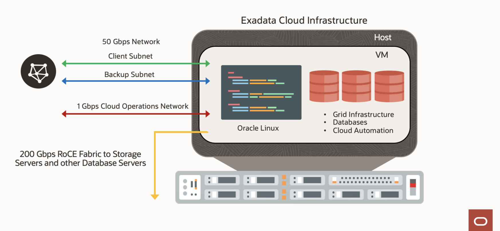

## Introduction

This workshop walks you through all the steps to get started using the Oracle Exadata Database Service on Dedicated Infrastructure to perform lifecycle tasks and procedures.

**Oracle Exadata Database Service**

Oracle Exadata Database Service is an automated Oracle Database service that allows organizations to run databases with the highest performance, availability, security, and cost-effectiveness. Databases run faster and with fewer resources on scale-out Exadata infrastructure that includes unique optimizations for transaction processing, analytics, and mixed workloads. Online scaling of computing resources enables customers to quickly adjust consumption to match workload demands without interrupting operations while efficient database consolidation lowers total costs. Full compatibility with on-premises Oracle Database and Exadata environments makes it easy for customers to migrate workloads to the cloud.

Exadata Database Service allows you to leverage the power of Exadata in the cloud. Exadata Database Service’s scale-out architecture allows customers to provision more compute and storage independently easily, right-sizing their service to meet growing demands. Exadata Database Service offer RDMA over Converged Ethernet (RoCE) networking for high bandwidth and low latency, persistent memory (PMEM) modules, and intelligent Exadata software.

Built-in Oracle Maximum Availability Architecture (Oracle MAA) best practices increase database availability, Exadata Database Service reduces downtime and simplifies operational management with zero downtime maintenance, online scaling, and one-click provisioning of Oracle Real Application Clusters (Oracle RAC) and Oracle Active Data Guard using built-in cloud automation

**Deployment Models**

* Exadata Database Service on Dedicated Infrastructure - Exadata Database Service running in the public cloud (OCI)
* Exadata Database Service on Cloud@Customer - Exadata Database Service running on Exadata Cloud@Customer in your data center

**Network Overview: Exadata Database Service on Dedicated Infrastructure**

The Diagram outlines the high-level network architecture for Exadata Database Service on Dedicated Infrastructure.

**The Exadata Database Service on Dedicated Infrastructure** runs on the Exadata hosts which are virtualized with **Dom0** for Oracle managed components and **DomU** for user managed components.
Your databases run on one or more virtual machines (VM) hosted on DomU.
Each Exadata Database Service instance provides two 25 Gbps networks for customer access: (Client and Backup)
Each Exadata Database Service instance provides a 1Gbps Cloud Operations network for use by the Oracle Cloud Operation team for Infrastructure maintenance.

**The Client Network** connects the Exadata database servers to your existing client network and is used for client access to the virtual machines.
Applications access databases on Exadata Database Service through this network using Single Client Access Name (SCAN) and Oracle Real Application Clusters (Oracle RAC) Virtual IP (VIP) interfaces.
The client access network uses a pair of network interfaces on each database server, which are connected to the customer network.

**The Backup Network** is similar to the client access network, as it connects the Exadata Database servers provided to separates backup traffic and bulk transfers from application traffic.
Like the client network, the backup network uses a pair of network interfaces on each database server, which are connected to the customer network.

**The Oracle Cloud Operations Network** is a dedicated network connection used to perform infrastructure management tasks.
This network is solely for infrastructure management purposes conducted by the Oracle Operations team and cannot be accessed by customers.

**The RDMA Over Converged Ethernet (ROCE) Fabric Network** connects the Exadata database servers, and Exadata Storage Servers using the ROCE switches on the rack.
Each Database server and Storage server contains two ROCE interface (re0 and re1) that are connected to separate ROCE switches in the rack.
Oracle Database uses this network for Oracle RAC cluster interconnect traffic and for accessing data on Exadata Storage Servers.

When you subscribe to the Exadata Database Service on Dedicated Infrastructure, Oracle owns and manages the Exadata Infrastructure, and customers manage everything that runs in the database VM. The Customer VM known as DOMU includes the database software, grid infrastructure, data, schema, and encryption keys. You can schedule maintenance windows for Oracle to performance infrastructure maintenance during a window that best aligns with their business needs.

The Exadata Database Service simplifies lifecycle tasks, such as provisioning, scaling, patching, backup, and disaster recovery through Cloud Automation.

Application users and administrators can connect only to the database servers, using the CLIENT and BACKUP networks that you create while provisioning the Exadata Cloud Infrastructure & VM Cluster Resources. You access your database through standard Oracle database connection methods, such as Oracle Net. You access the VM cluster through standard Oracle Linux methods, such as token-based Secure Shell (SSH). Your administrator can use the web-based OCI Console, OCI command-line interface (CLI), and REST APIs to connect to your Exadata Database Service over an HTTPS connection.

These hands-on lab guides provide step-by-step directions to setting up and using your Exadata Database Service on Dedicated Infrastructure

## Lab Breakdown

* Lab 1. Create your Virtual Cloud Network (VCN) and Required IAM Policy for Exadata Database Service on Dedicated Infrastructure
* Lab 2. Create an Exadata Cloud Infrastructure resource
* Lab 3. Create a Cloud VM Cluster resource
* Lab 4. Create Oracle Database Home on an Exadata Database Service on Dedicated Infrastructure       
* Lab 5. Create Oracle Database on an Exadata Database Service on Dedicated Infrastructure
* Lab 6. Connect to an Exadata Database Service on Dedicated Infrastructure Instance
* Lab 7. Enable Automatic Backups for a Database
* Lab 8. Enable Data Guard on an Exadata Database Service on Dedicated Infrastructure

# Introduction

## Acknowledgements

* **Author** - Leo Alvarado, Product Management

* **Contributors** - Tammy Bednar, Eddie Ambler, Product Management

* **Last Update** - May 2022.

**You are all set. Let us begin!**
