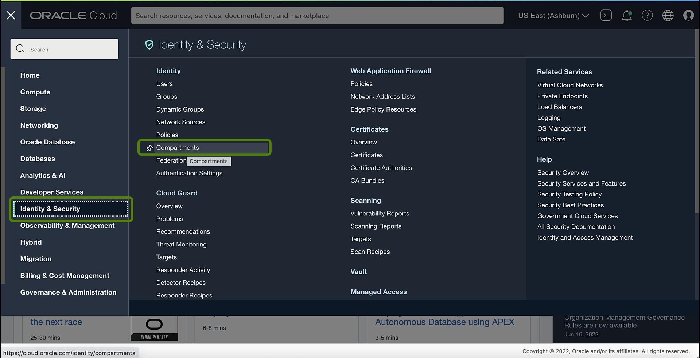
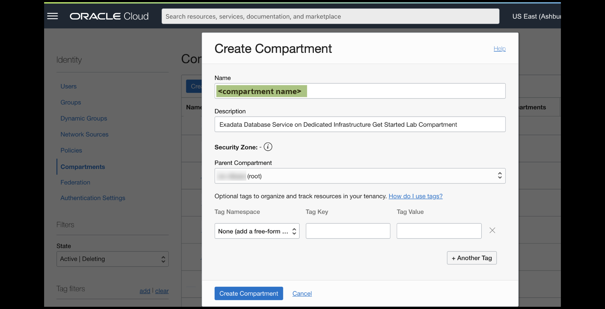
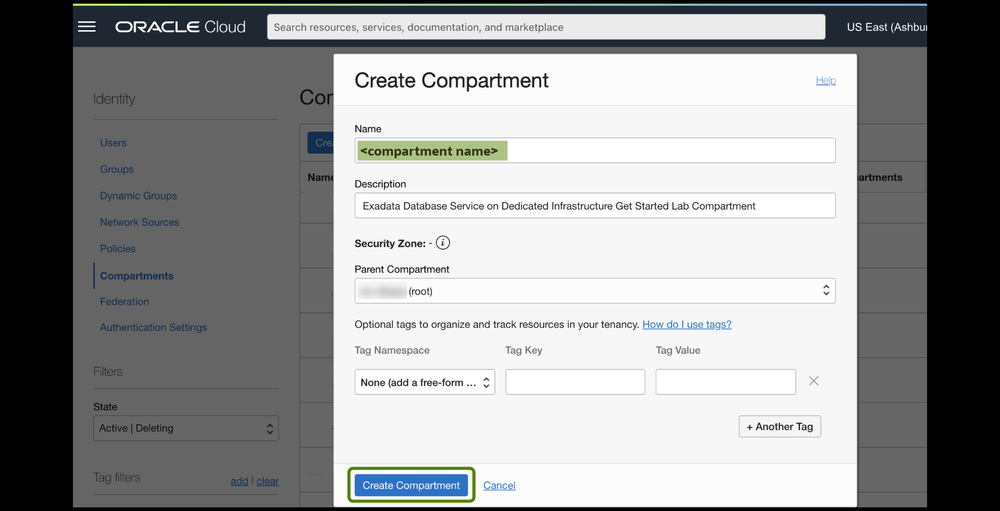
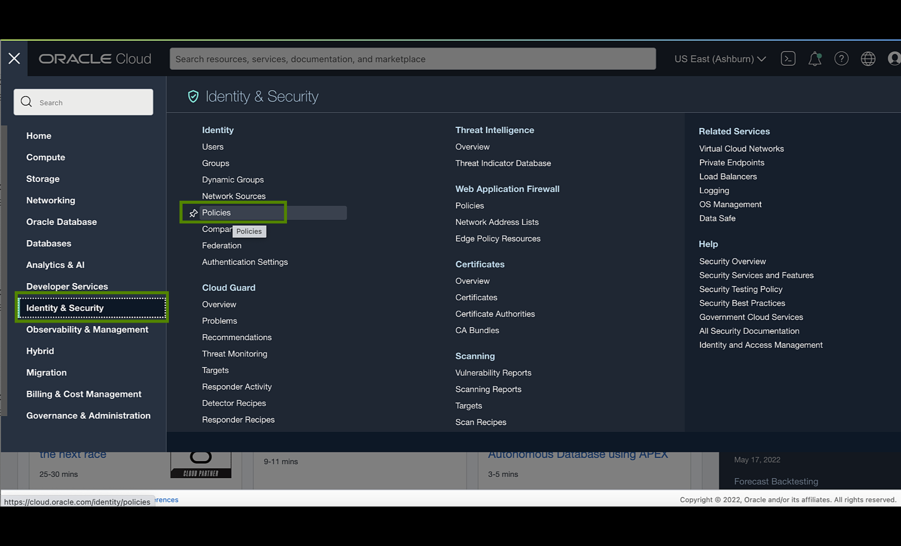
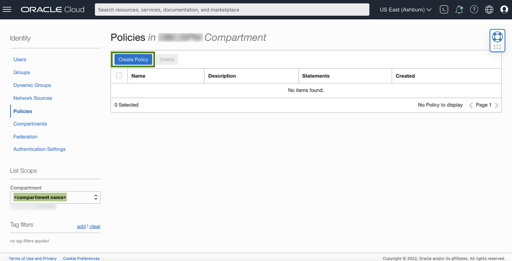
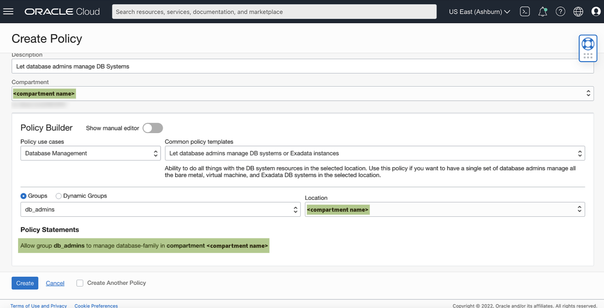
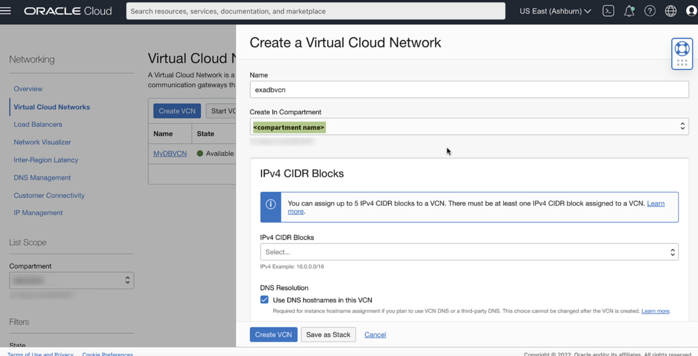
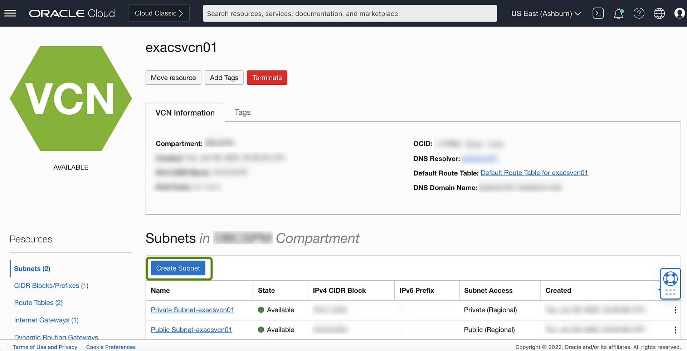

<!-- Updated April 5, 2022 -->

# Create your Virtual Cloud Network (VCN) and Required IAM Policy for Exadata Database Service on Dedicated Infrastructure

## Introduction

This lab walks you through the steps to Prepare and describe the recommended configuration for your Network and Required IAM Policy for Exadata Database Service on Dedicated Infrastructure.

Estimated Time: 10 minutes

### Objectives

-   Prepare and Create the recommended configuration for your Network and Required IAM Policy for Exadata Database Service on Dedicated Infrastructure.

### Prerequisites

This lab requires completion of the following:

* Setting Up Your Tenancy - After Oracle creates your tenancy in OCI, an administrator at your company will need to perform some set up tasks and establish an organization plan for your cloud resources and users.

## Task 1: Required IAM Policy for Exadata Database Service on Dedicated Infrastructure.

1. Create a Compartment. Open the navigation menu and click **Identity & Security**. Under Identity, click **Compartments**. A list of the compartments you have access to is displayed.

     

    Navigate to the compartment in which you want to create the new compartment:

    * To create the compartment in the tenancy (root compartment) click Create Compartment.
    * Otherwise, click through the hierarchy of compartments until you reach the detail page of the compartment in which you want to create the compartment. On the Compartment Details page, click Create Compartment.

    

    Enter the following:

    * **Name**: A unique name for the compartment (maximum 100 characters, including letters, numbers, periods, hyphens, and underscores). The name must be unique across all the compartments in your tenancy.
    * **Description**: A friendly description. You can change this later if you want to.
    * **Parent Compartment**: The compartment you are in is displayed. To choose another compartment to create this compartment in, select it from the list.
    * **Tags**: If you have permissions to create a resource, then you also have permissions to apply free-form tags to that resource. To apply a defined tag, you must have permissions to use the tag namespace. For more information about tagging, see Resource Tags. If you are not sure whether to apply tags, skip this option (you can apply tags later) or ask your administrator.

    Click **Create Compartment**.

     

2. Review the identity access management (IAM) policy for provisioning Oracle Exadata Database Service on Dedicated Infrastructure systems.

    Click the navigation menu Click **Identity & Security**, then click **Policies**.

     

3. Select **Compartment**, Under Identity in the **Policies** section Click **Create Policy**

     

     A **policy** is an IAM document that specifies who has what type of access to your resources. It is used in different ways:

       * An individual statement written in the policy language
       * A collection of statements in a single, named "policy" document, which has an Oracle Cloud ID (OCID) assigned to it
       * The overall body of policies your organization uses to control access to resources

     A **compartment** is a collection of related resources that can be accessed only by certain groups that have been given permission by an administrator in your organization.

     To use Oracle Cloud Infrastructure, you must be given the required type of access in a policy written by an administrator, whether you're using the Console, or the REST API with a software development kit (SDK), a command-line interface (CLI), or some other tool. If you try to perform an action, and receive a message that you don’t have permission, or are unauthorized, then confirm with your tenancy administrator the type of access you've been granted, and which compartment you should work in.

     For administrators: The policy in "Let database admins manage DB systems" lets the specified group do everything with databases, and related database resources.

    

     If you're new to policies, then see [Getting Started with Policies](https://docs.oracle.com/en-us/iaas/Content/Identity/Concepts/policygetstarted.htm) and [Common Policies] (https://docs.oracle.com/en-us/iaas/Content/Identity/policiescommon/commonpolicies.htm). If you want to dig deeper into writing policies for databases, then see [Details for the Database Service](https://docs.oracle.com/en-us/iaas/Content/Identity/Reference/databasepolicyreference.htm).

## Task 2: Prepare the Network Setup for Exadata Database Service on Dedicated Infrastructure

 To launch an Exadata Cloud Infrastructure instance, you must have a Virtual Cloud Network and at least two subnets:

 * A VCN in the region where you want the Exadata Cloud Infrastructure instance
 * At least two subnets in the VCN. The two subnets are:

    * Client subnet
    * Backup subnet

 * Choose which method of DNS name resolution you will use. See Choices for DNS in Your VCN

1. Click the navigation menu Click **Networking**, then click **Virtual Cloud Networks**.

    

2. Select your **Compartment**, Under Networking in the **Virtual Cloud Networks** Click on **Create VCN**

    

3. In the Create a Virtual Cloud Network Page Enter the following:  

   **Name**: A descriptive name for the VCN. It doesn't have to be unique, and it cannot be changed later in the Console (but you can change it with the API). Avoid entering confidential information.

   **Create in Compartment**: Select a compartment

   **IPv4 CIDR Blocks**: Up to five but at least one non-overlapping IPv4 CIDR blocks for the VCN. For example: 172.16.0.0/16. You can add or remove CIDR blocks later. See [Allowed VCN Size and Address Ranges](https://docs.oracle.com/en-us/iaas/Content/Network/Concepts/overview.htm#Allowed)

   **Use DNS Hostnames in this VCN**: Required for assignment of DNS hostnames to hosts in the VCN, and required if you plan to use the VCN's default DNS feature (called the Internet and VCN Resolver). If the check box is selected, you can specify a DNS label for the VCN, or allow the Console to generate one for you. The dialog box automatically displays the corresponding **DNS Domain Name** for the VCN (<VCN DNS label>.oraclevcn.com). For more information, See [DNS in Your Virtual Cloud Network](https://docs.oracle.com/en-us/iaas/Content/Network/Concepts/dns.htm#DNS_in_Your_Virtual_Cloud_Network).

   **IPv6 prefixes**: You can request that a single Oracle-allocated IPv6 /56 prefix is assigned to this VCN. Alternately, you can assign a BYOIPv6 prefix or ULA prefix to the VCN. This option is available for all commercial and government regions. For more information on IPv6, See [IPv6 Addresses](https://docs.oracle.com/en-us/iaas/Content/Network/Concepts/ipv6.htm#IPv6_Addresses).

   Click **Create VCN**.

    

4. Create a Subnet.

    Two Subnets are required in the VCN for the **Client Subnet** and **Backup Subnet**.

    

    In general, Oracle recommends using **regional subnets** , which span all **availability domains** in the region. For more information, See [Overview of VCNs and Subnets](https://docs.oracle.com/iaas/Content/Network/Tasks/managingVCNs_topic-Overview_of_VCNs_and_Subnets.htm#Overview).

    You will create custom route tables for each subnet. You will also create security rules to control traffic to and from the client network and backup network of the Exadata compute nodes (for The Cloud VM Cluster Resource, nodes are called virtual machines). More information follows about those items.

      * [Option 1: Public Client Subnet with Internet Gateway](https://docs.oracle.com/en-us/iaas/exadatacloud/exacs/ecs-network-setup.html#GUID-D8296957-E344-4688-B626-42A99E1D164B)

        This option can be useful when doing a proof-of-concept or development work.

      * [Option 2: Private Subnets](https://docs.oracle.com/en-us/iaas/exadatacloud/exacs/ecs-network-setup.html#GUID-51C3EC2C-20DA-4EE5-B882-CD500FA6F7C6)

        Oracle recommends private subnets for a production system.

      * [Requirements for IP Address Space](https://docs.oracle.com/en-us/iaas/exadatacloud/exacs/ecs-network-setup.html#GUID-D5C577A1-BC11-470F-8A91-77609BBEF1EA)

        IP addresses must not overlap, especially when Exadata Cloud Infrastructure instances (and thus VCNs) are in more than one region.

      * [Configuring a Static Route for Accessing the Object Store](https://docs.oracle.com/en-us/iaas/exadatacloud/exacs/ecs-network-setup.html#GUID-0D0C113E-602F-4736-936F-9619A0465467)

      * [Setting Up DNS for an Exadata Cloud Infrastructure Instance](https://docs.oracle.com/en-us/iaas/exadatacloud/exacs/ecs-network-setup.html#GUID-2AE89C4B-71F5-4B97-AC42-54FE395CA87F)

      * [DNS: Short Names for the VCN, Subnets, and Exadata Cloud Infrastructure instance](https://docs.oracle.com/en-us/iaas/exadatacloud/exacs/ecs-network-setup.html#GUID-7ADB66F2-A2B3-4764-89B8-826BBA0A5BBA)

      * [DNS: Between On-Premises Network and VCN](https://docs.oracle.com/en-us/iaas/exadatacloud/exacs/ecs-network-setup.html#GUID-EA1739CF-001D-4D42-A839-C7BD5B4BA524)

      > **Note:** For Exadata Cloud Infrastructure instances, networking is configured on the cloud VM cluster resource.

You may now **proceed to the next lab**

## Learn More

Click [here](https://docs.oracle.com/en-us/iaas/exadatacloud/exacs/preparing-for-ecc-deployment.html) for documentation on Oracle Cloud Infrastructure (OCI) Requirements for Oracle Exadata Database Service on Dedicated Infrastructure.

## Acknowledgements

* **Author** - Leo Alvarado, Product Management

* **Contributors** - Tammy Bednar, Eddie Ambler, Product Management

* **Last Update** - May 2022.
