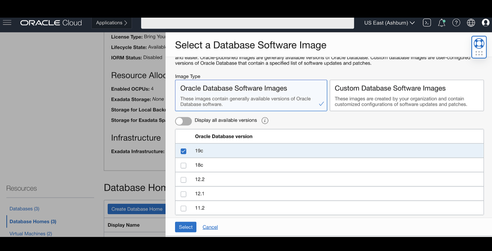
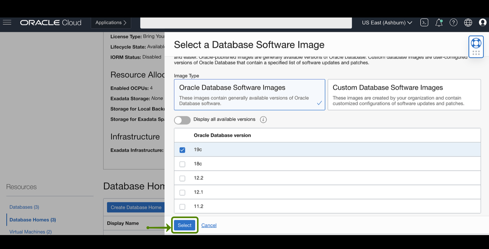
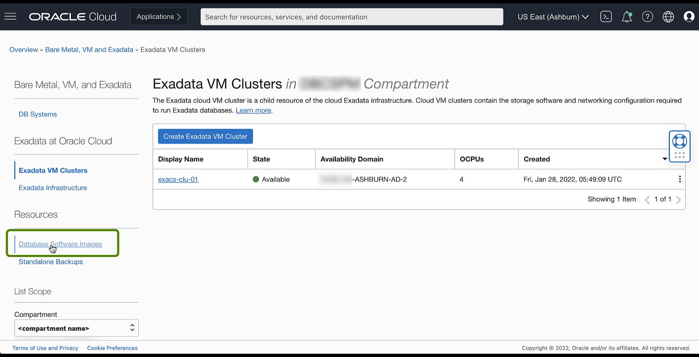
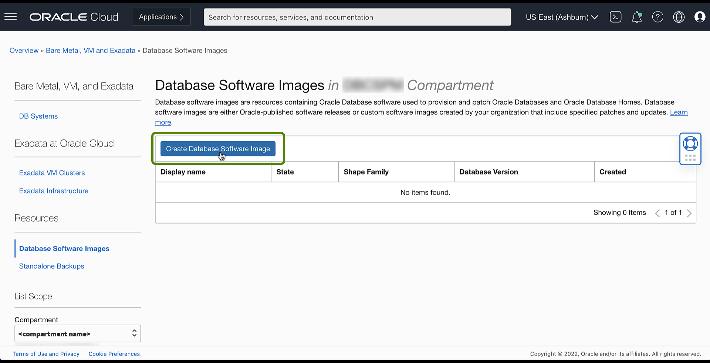
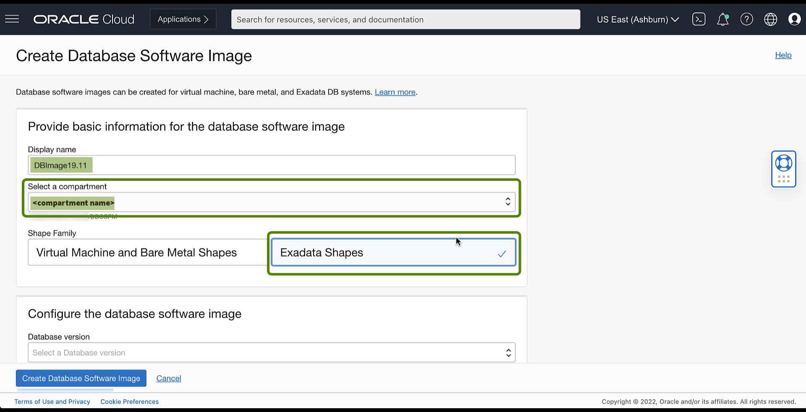

<!-- Updated April 5, 2022 -->

# Create Oracle Database Home on an Exadata Database Service on Dedicated Infrastructure

## Introduction

This lab walks you through the steps to Create Oracle Database Home on Exadata Database Service on Dedicated Infrastructure

Estimated Time: 10 minutes

### Objectives

-   Create Oracle Database Home on Exadata Database Service on Dedicated Infrastructure

### Prerequisites

This lab requires completion of the following:

* Completion of [Lab 3: Create a Cloud VM Cluster resource](?lab=lab3-create-cloud-vmcluster) section.
* A correctly configured virtual cloud network (VCN) to launch the system in. Its related networking resources (gateways, route tables, security lists, DNS, and so on) must also be configured as necessary for the system
* The proper IAM policy is required to proceed See [Required IAM Policy for Exadata Cloud Infrastructure](https://docs.oracle.com/en-us/iaas/exadatacloud/exacs/preparing-for-ecc-deployment.html#GUID-EA03F7BC-7D8E-4177-AFF4-615F71C390CD).

## Task 1: Create Oracle Database Home

1.  Click the navigation menu Click **Oracle Database**, then click **Exadata on Oracle Public Cloud**.

    

2.  Choose your **Compartment**

    

3.  Navigate to the cloud VM cluster or DB system you want to create the new Database Home on:

    Under **Oracle Exadata Database Service on Dedicated Infrastructure**, Click **Exadata VM Clusters**. In the list of VM clusters, find the VM cluster you want to access and click its highlighted name to view the details page for the cluster.

    

4.  Under Resources, click Database Homes. A list of Database Homes is displayed.

    

5.  Click Create Database Home.

    

6.  In the **Create Database Home** dialog, enter the following:

    **Database Home display name**: The display name for the Database Home. Avoid entering confidential information.

    

    **Database image**: Determines what Oracle Database version is used for the database. You can have databases with different minor versions the same database home. The major versions must remain the same. By default, the latest Oracle-published database software image is selected.

    Click **Change Database Image** to use an older Oracle-published image or a custom database software image that you have created in advance, then select an Image Type:

    

    * **Oracle Provided Database Software images**: These images contain generally available versions of Oracle Database software.

    * **Custom Database Software images**: These images are created by your organization and contain customized configurations of software updates and patches. Use the **Select a compartment** and **Select a Database version** selectors to limit the list of custom database software images to a specific compartment or Oracle Database software major release version.

    

       After choosing a software image, click **Select** to return to the Create Database dialog.

    

    Click **Show Advanced Options** to specify advanced options for the Database Home

       **Tags**: If you have permissions to create a resource, then you also have permissions to apply free-form tags to that resource. To apply a defined tag, you must have permissions to use the tag namespace.

       

7. Click **Create**

   

   When the Database Home creation is complete, the status changes from **Provisioning** to **Available**.

   

   

You may now **proceed to the next lab**

## Additional Task (Optional): Create Custom Database Software Image

1.  Click the navigation menu Click **Oracle Database**, then click **Exadata on Oracle Public Cloud**.

    

2.  Under **Resources**, click **Database Software images**.

    

3.  Click **Create Database Software Image**.

    

4.  In the **Display name** field, provide a display name for your image. Avoid entering confidential information.

    

    Choose your **Compartment**.

    Choose a **Shape family**. A custom database software image is compatible with only one shape family. Available shape families are
    the following:

       * Bare metal and virtual machine DB systems
       * Exadata Cloud Service instances

5.  Choose the **Database version** for your image. You can create a database software image using any supported Oracle Database release
    update (RU).

    

6.  Choose the **patch set update, proactive bundle patch, or release update**.

    

       * *Optionally*, you can enter a comma-separated list of one-off (interim) patch numbers.

       * *Optionally*, you can upload an Oracle Home inventory file from an existing Oracle Database.

    

7.  Click Create Database Software Image.

    

## Want to Learn More?

Click [here](https://docs.oracle.com/en-us/iaas/exadatacloud/exacs/ecs-manage-dbhomes.html) for documentation on Managing Oracle Database Homes on an Exadata Cloud Infrastructure Instance.

## Acknowledgements

* **Author** - Leo Alvarado, Product Management

* **Contributors** - Tammy Bednar, Eddie Ambler, Product Management

* **Last Update** - May 2022.
