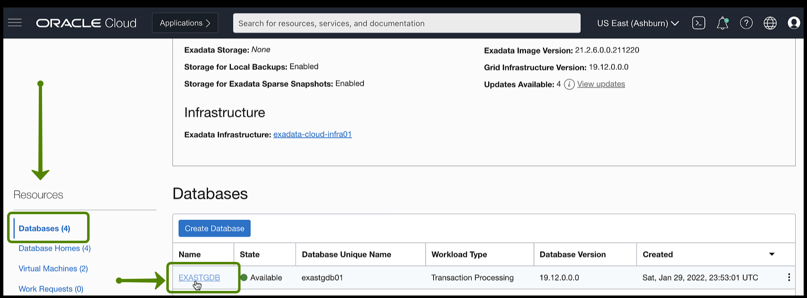
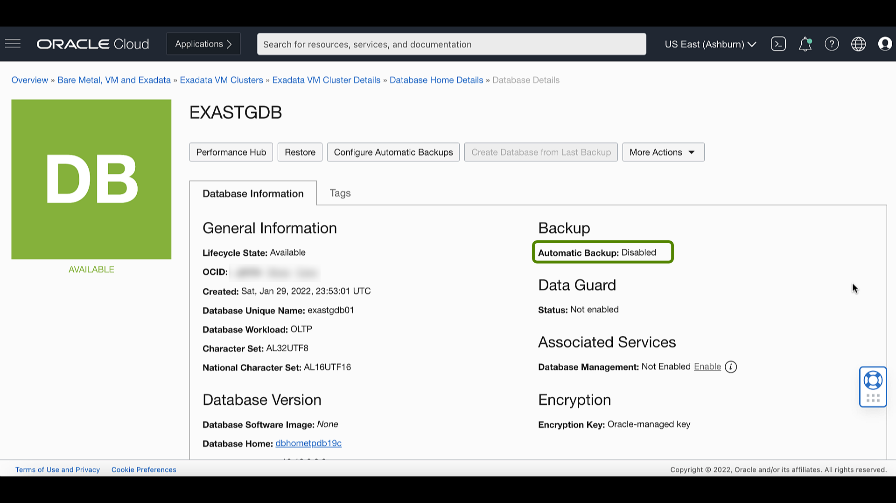
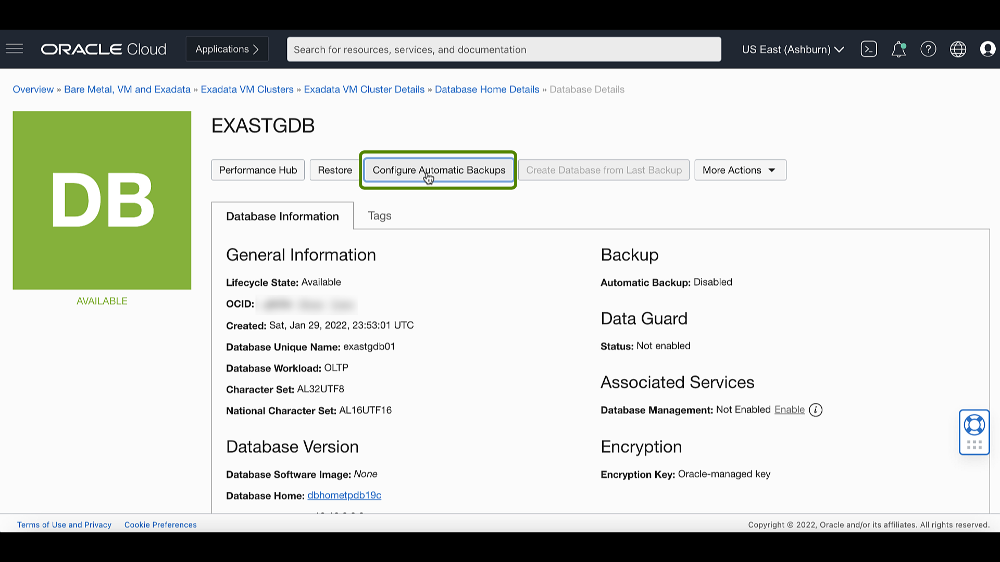

# Enable Automatic Backups for a Database

## Introduction

This lab walks you through how to Enable Automatic Backups for a Database.

Estimated Time: 5 minutes

### Objectives

-   Enable Automatic Backups for a Database

### Prerequisites

This lab requires completion of the following:

* Completion of Lab 5: Create Oracle Database on Exadata Database Service on Dedicated Infrastructure section.
* To launch the system, a correctly configured virtual cloud network (VCN). Its related networking resources (gateways, route tables, security lists, DNS, and so on) must also be configured as necessary for the system.
* The right IAM policy is required to proceed. See [Required IAM Policy for Exadata Cloud Infrastructure](https://docs.oracle.com/en-us/iaas/exadatacloud/exacs/preparing-for-ecc-deployment.html#GUID-EA03F7BC-7D8E-4177-AFF4-615F71C390CD).

## Task 1: Configure automatic backups for a database

1. Click the navigation menu Click **Oracle Database**, then click **Exadata on Oracle Public Cloud**.

    

2. Choose your **Compartment**

    

3. Navigate to the cloud VM cluster containing the database you want to configure:

    Under **Oracle Exadata Database Service on Dedicated Infrastructure**, Click **Exadata VM Clusters**. In the list of VM clusters, find the VM cluster you want to access and click its highlighted name to view the details page for the cluster.

    

4. In the list of databases, find the database for which you want to enable or disable automatic backups and click its name to
   display database details.

   

   The details indicate whether automatic backups are enabled.

   

5. Click Configure Automatic Backups

   

6. In the Configure Automatic Backups dialog, check **Enable Automatic Backup**.

   

   If you are enabling automatic backups, you can choose one of the following preset retention periods: 7 days, 15 days, 30 days, 45 days, or 60 days. The default selection is 30 days.

   

   Select Backup Scheduling

   

7. Click Save Changes

   

   Once Automatic Backup is configured for a database, you can see that automatic backups are enabled from the Database details page.

   

You may now **proceed to the next lab**.

## Learn More

Click [here](https://docs.oracle.com/en-us/iaas/exadatacloud/exacs/ecs-managing-db-backup-and-recovery.html) for documentation to Manage Database Backup and Recovery on Oracle Exadata Database Service on Dedicated Infrastructure.

## Acknowledgements

* **Author** - Leo Alvarado, Product Management

* **Contributors** - Tammy Bednar, Eddie Ambler, Product Management

* **Last Update** - June 2022.
