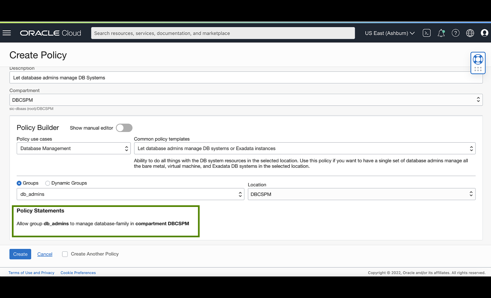

<!-- Updated April 5, 2022 -->

# Create your Virtual Cloud Network (VCN) and Required IAM Policy for Exadata Database Service on Dedicated Infrastructure

## Introduction

This lab walks you through the steps to Prepare and describe the recommended configuration for your Network and Required IAM Policy for Exadata Database Service on Dedicated Infrastructure.<!--You will use this database in subsequent labs of this workshop.-->

Estimated Lab Time: 10 minutes

### Objectives

-   Prepare and Create the recommended configuration for your Network and Required IAM Policy for Exadata Database Service on Dedicated Infrastructure.

### Prerequisites

*Note: This lab requires completion of the following:*

* Setting Up Your Tenancy - After Oracle creates your tenancy in OCI, an administrator at your company will need to perform some set up tasks and establish an organization plan for your cloud resources and users.

## Task 1: Required IAM Policy for Exadata Database Service on Dedicated Infrastructure.

1. Review the identity access management (IAM) policy for provisioning Oracle Exadata Database Service on Dedicated Infrastructure systems.

    Click the navigation menu Click **Identity & Security**, then click **Policies**.

     

2. Select **Compartment**, Under Identity in the **Policies** section Click **Create Policy**

     

     A **policy** is an IAM document that specifies who has what type of access to your resources. It is used in different ways:

       * An individual statement written in the policy language
       * A collection of statements in a single, named "policy" document, which has an Oracle Cloud ID (OCID) assigned to it
       * The overall body of policies your organization uses to control access to resources

     A **compartment** is a collection of related resources that can be accessed only by certain groups that have been given permission by an administrator in your organization.

     To use Oracle Cloud Infrastructure, you must be given the required type of access in a policy written by an administrator, whether you're using the Console, or the REST API with a software development kit (SDK), a command-line interface (CLI), or some other tool. If you try to perform an action, and receive a message that you don’t have permission, or are unauthorized, then confirm with your tenancy administrator the type of access you've been granted, and which compartment you should work in.

     For administrators: The policy in "Let database admins manage DB systems" lets the specified group do everything with databases, and related database resources.

     

     If you're new to policies, then see "Getting Started with Policies" and "Common Policies". If you want to dig deeper into writing policies for databases, then see "Details for the Database Service".

## Task 2: Prepare the Network Setup for Exadata Database Service on Dedicated Infrastructure

 To launch an Exadata Cloud Infrastructure instance, you must have a Virtual Cloud Network and at least two subnets:

 * A VCN in the region where you want the Exadata Cloud Infrastructure instance
 * At least two subnets in the VCN. The two subnets are:

    * Client subnet
    * Backup subnet

 * Choose which method of DNS name resolution you will use. See Choices for DNS in Your VCN

1. Click the navigation menu Click **Networking**, then click **Virtual Cloud Networks**.

    

2. Select your **Compartment**, Under Networking in the **Virtual Cloud Networks** Click on **Create VCN**

    

    

    *Note:*

    For Exadata Cloud Infrastructure instances, networking is configured on the cloud VM cluster resource.

    

    In general, Oracle recommends using **regional subnets** , which span all **availability domains** in the region. For more information, See <a href="https://docs.oracle.com/iaas/Content/Network/Tasks/managingVCNs_topic-Overview_of_VCNs_and_Subnets.htm#Overview" target="\_blank">Overview of VCNs and Subnets</a>.

    You will create custom route tables route tables for each subnet. You will also create security rulessecurity rules to control traffic to and from the client network and backup network of the Exadata compute nodes (for The Cloud VM Cluster Resource, nodes are called virtual machines). More information follows about those items.

      * <a href="https://docs.oracle.com/en-us/iaas/exadatacloud/exacs/ecs-network-setup.html#GUID-D8296957-E344-4688-B626-42A99E1D164B" target="\_blank">Option 1: Public Client Subnet with Internet Gateway</a>

        This option can be useful when doing a proof-of-concept or development work.

      * <a href="https://docs.oracle.com/en-us/iaas/exadatacloud/exacs/ecs-network-setup.html#GUID-51C3EC2C-20DA-4EE5-B882-CD500FA6F7C6" target="\_blank">Option 2: Private Subnets</a>

        Oracle recommends private subnets for a production system.

      * <a href="https://docs.oracle.com/en-us/iaas/exadatacloud/exacs/ecs-network-setup.html#GUID-D5C577A1-BC11-470F-8A91-77609BBEF1EA" target="\_blank">Requirements for IP Address Space</a>

        IP addresses must not overlap, especially when Exadata Cloud Infrastructure instances (and thus VCNs) are in more than one region.

      * <a href="https://docs.oracle.com/en-us/iaas/exadatacloud/exacs/ecs-network-setup.html#GUID-0D0C113E-602F-4736-936F-9619A0465467" target="\_blank">Configuring a Static Route for Accessing the Object Store</a>

      * <a href="https://docs.oracle.com/en-us/iaas/exadatacloud/exacs/ecs-network-setup.html#GUID-2AE89C4B-71F5-4B97-AC42-54FE395CA87F" target="\_blank">Setting Up DNS for an Exadata Cloud Infrastructure Instance</a>

      * <a href="https://docs.oracle.com/en-us/iaas/exadatacloud/exacs/ecs-network-setup.html#GUID-7ADB66F2-A2B3-4764-89B8-826BBA0A5BBA" target="\_blank">DNS: Short Names for the VCN, Subnets, and Exadata Cloud Infrastructure instance</a>

      * <a href="https://docs.oracle.com/en-us/iaas/exadatacloud/exacs/ecs-network-setup.html#GUID-EA1739CF-001D-4D42-A839-C7BD5B4BA524" target="\_blank">DNS: Between On-Premises Network and VCN</a>

     You may now **proceed to the next lab**

## Want to Learn More?

Click [here](https://docs.oracle.com/en-us/iaas/exadatacloud/exacs/preparing-for-ecc-deployment.html) for documentation on Oracle Cloud Infrastructure (OCI) Requirements for Oracle Exadata Database Service on Dedicated Infrastructure.

## Acknowledgements

* **Author** - Leo Alvarado, Product Management

* **Contributors** - Tammy Bednar, Eddie Ambler, Product Management

* **Last Update** - May 2022.
