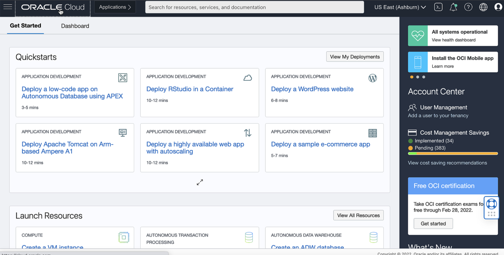
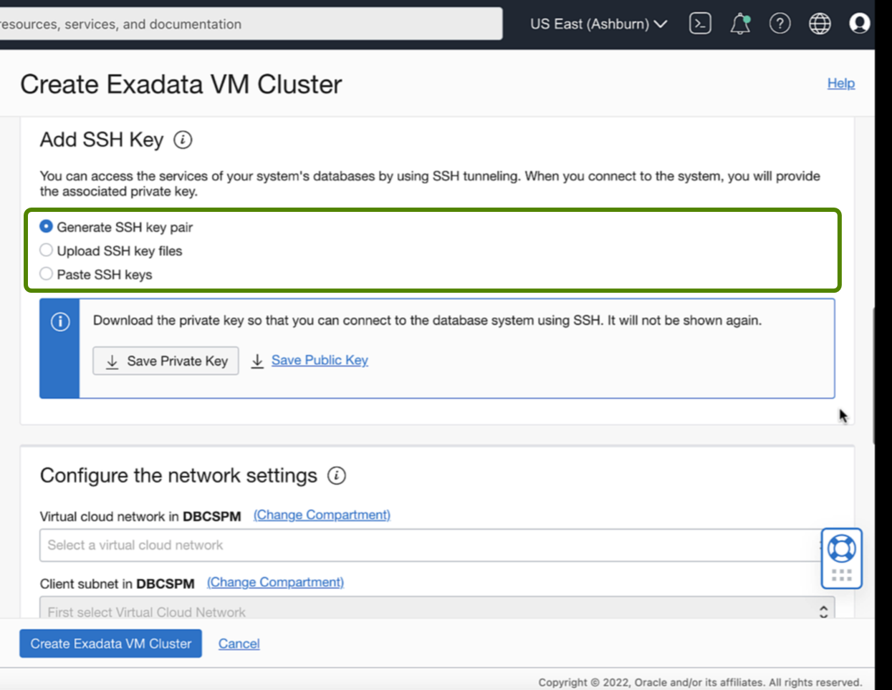

<!-- Updated April 5, 2022 -->

# Create a Cloud VM Cluster resource

## Introduction

This lab walks you through the steps to create a Cloud VM Cluster resource <!--You will use this database in subsequent labs of this workshop.-->

Estimated Lab Time: 10 minutes

### Objectives

-   Create a new Cloud VM Cluster resource

### Prerequisites

*Note: This lab requires completion of the following:*

* Completion of [Lab 2: Create an Exadata Cloud Infrastructure resource](?lab=Lab2-create-exacloud-infra) section.
* A correctly configured virtual cloud network (VCN) to launch the system in. Its related networking resources (gateways, route tables, security lists, DNS, and so on) must also be configured as necessary for the system
* The proper IAM policy is required to proceed See <a href="https://docs.oracle.com/en-us/iaas/exadatacloud/exacs/preparing-for-ecc-deployment.html#GUID-EA03F7BC-7D8E-4177-AFF4-615F71C390CD" target="\_blank">Required IAM Policy for Exadata Cloud Service</a>.

 <!-- add hyperlink for policies -->

 <!--
* The public key, in OpenSSH format, from the key pair that you plan to use for connecting to the system via SSH  -->

## Task 1: Create a Cloud VM Cluster resource

1. Log in to the Oracle Cloud, Once you are logged in, you are taken to the cloud services dashboard where you can see all the services available to you.

    

2.  Click the navigation menu Click **Oracle Database**, then click **Exadata on Oracle Public Cloud**.

    

3. Under **Oracle Exadata Database Service on Dedicated Infrastructure**, click **Exadata VM Clusters**.

    

4. Click **Create Exadata VM Cluster**.

    

    In the Create Exadata VM Cluster Page, Provide the required information to configure the VM cluster.

5. **Compartment**: Select a compartment for the VM cluster resource.
6. **Display name**: Enter a user-friendly display name for the VM cluster.

    

7. **Select Exadata infrastructure**: Select the infrastructure resource that will contain the VM cluster.     
     Currently, cloud Exadata infrastructure resources support only one VM cluster, so you must choose an infrastructure resource that does not have an existing VM cluster. Click Change Compartment and pick a different compartment from the one you are working in to view infrastructure resources in other compartments.

     

8. **Configure the VM cluster**: Specify the number of OCPU cores you want to allocate to each of the VM  
     cluster's virtual machine compute nodes. The read-only Requested OCPU count for the Exadata VM cluster field displays the total number of OCPU cores you are allocating.

     

9. **Configure Exadata storage**: Specify the following:

   **Allocate storage for Exadata sparse snapshots**: Select this configuration option if you intend to use snapshot functionality within your VM cluster. If you select this option, the SPARSE disk group is created, which enables you to use VM cluster snapshot functionality for PDB sparse cloning. If you do not select this option, the SPARSE disk group is not created and snapshot functionality will not be available on any database deployments that are created in the environment.

   **Allocate storage for local backups**: Select this option if you intend to perform database backups to the local Exadata storage within your Exadata Cloud Service instance. If you select this option, more space is allocated to the RECO disk group, which is used to store backups on Exadata storage. If you do not select this option, more space is allocated to the DATA disk group, which enables you to store more information in your databases.

      

10. **Add SSH key**: Add the public key portion of each key pair you want to use for SSH access to the DB system.

    **Upload SSH key files**: Select this radio button to browse or drag and drop .pub files.

    **Paste SSH keys**: Select this radio button to paste in individual public keys. To paste multiple keys, click + Another SSH Key, and supply a single key for each entry.

      

11. **Configure the network settings**: Specify the following:

    **Virtual cloud network**: The VCN in which you want to create the VM cluster. Click Change Compartment to select a VCN in a different compartment.

    **Client subnet**: The subnet to which the VM cluster should attach. Click Change Compartment to select a subnet in a different compartment.

    *Note: Do not use a subnet that overlaps with 192.168.16.16/28, which is used by the Oracle Clusterware private interconnect on the database instance. Specifying an overlapping subnet causes the private interconnect to malfunction.*

    **Backup subnet**: The subnet to use for the backup network, which is typically used to transport backup information to and from Oracle Cloud Infrastructure Object Storage, and for Data Guard replication. Click Change Compartment to select a subnet in a different compartment, if applicable.

    *Note: Do not use a subnet that overlaps with 192.168.128.0/20. This restriction applies to both the client subnet and backup subnet.*

    If you plan to back up databases to Object Storage, see the network prerequisites in [Managing Exadata Database Backups.](https://docs.oracle.com/en-us/iaas/exadatacloud/exacs/ecs-managing-db-backup-and-recovery.html#GUID-0CA094F9-7160-43FA-AB23-D51986CBBE85)

    **Network Security Groups**: Optionally, you can specify one or more network security groups (NSGs);for both the client and backup networks. NSGs function as virtual firewalls, allowing you to apply a set of ingress and egress security rules to your Exadata Cloud Service VM cluster.

      

    **Hostname prefix**: Your choice of host name for the Exadata DB system. The host name must begin with an alphabetic character, and can contain only alphanumeric characters and hyphens (-). The maximum number of characters allowed for an Exadata DB system is 12.

    *Note: The host name must be unique within the subnet*. If it is not unique, the VM cluster will fail to provision.

    **Host domain name**: The domain name for the VM cluster. If the selected subnet uses the Oracle-provided Internet and VCN Resolver for DNS name resolution, this field displays the domain name for the subnet and it can't be changed. Otherwise, you can provide your choice of a domain name. Hyphens (-) are not permitted.

    If you plan to store database backups in Object Storage, Oracle recommends that you use a VCN Resolver for DNS name resolution for the client subnet because it automatically resolves the Swift endpoints used for backups.

    **Host and domain URL**: This read-only field combines the host and domain names to display the fully qualified domain name (FQDN) for the database. The maximum length is 64 characters.

        

12. Choose a license type: The type of license you want to use for the VM cluster. Your choice affects metering
    for billing.

    **License Included** means the cost of the cloud service includes a license for the Database service.

    **Bring Your Own License (BYOL)** means you are an Oracle Database customer with an Unlimited License Agreement or Non-Unlimited License Agreement and want to use your license with Oracle Cloud Infrastructure. This removes the need for separate on-premises licenses and cloud licenses.

      

13. Click **Show Advanced Options** to specify advanced options for the VM cluster:

    **Time zone**: This option is located in the Management tab. The default time zone for the DB system is UTC, but you can specify a different time zone.

      

    **SCAN Listener Port**: This option is located in the Network tab. You can assign a SCAN listener port (TCP/IP) in the range between 1024 and 8999. The default is 1521

      

    **Tags**: If you have permissions to create a resource, then you also have permissions to apply free-form tags to that resource. To apply a defined tag, you must have permissions to use the tag namespace. For more information about tagging, see Resource Tags . If you are not sure whether to apply tags, skip this option (you can apply tags later) or ask your administrator.

      

14. Click **Create Exadata VM Cluster**

      

    The Cloud VM Cluster resource appears in the Exadata VM Clusters list with a status of **Provisioning**.

      

    After your VM cluster is successfully created, The VM Cluster's icon changes from yellow to green and in **Available** state. You can view the VM Cluster Details  page by clicking the name of the VM cluster in the list of clusters.

      

     You may now **proceed to the next lab**

<!--

## Want to Learn More?

Click [here](https://docs.oracle.com/en/cloud/paas/autonomous-data-warehouse-cloud/user/autonomous-workflow.html#GUID-5780368D-6D40-475C-8DEB-DBA14BA675C3) for documentation on the typical workflow for using Autonomous Data Warehouse.

## Acknowledgements

- **Author** - Richard Green, Principal Developer, Database User Assistance
- **Last Updated By/Date** - Richard Green, April 2021 -->
