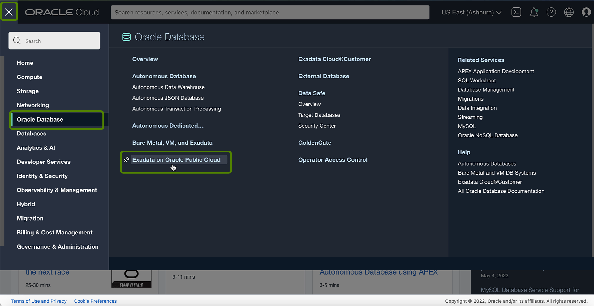
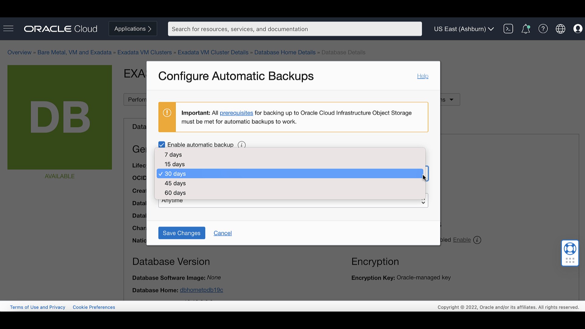
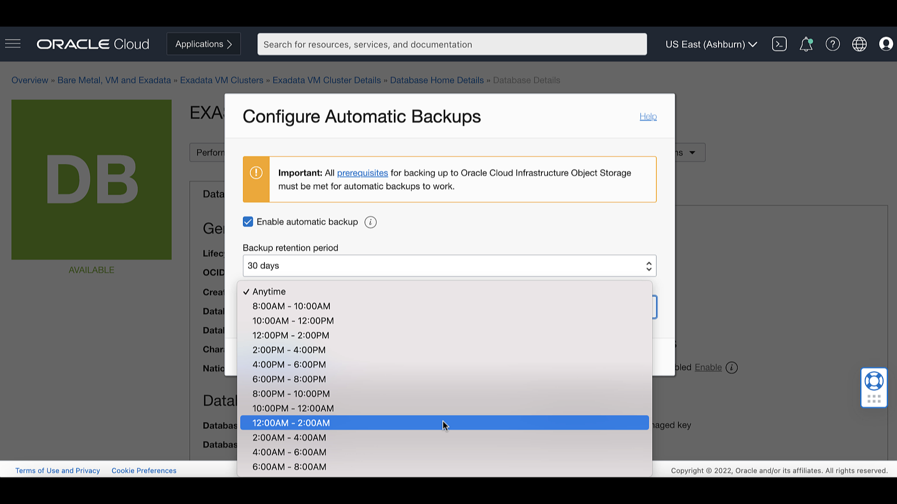
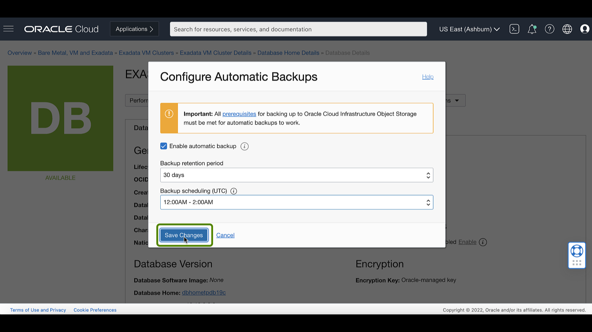

<!-- Updated April 5, 2022 -->

# Enable Automatic Backups for a Database

## Introduction

This lab walks you through the steps on how to Enable Automatic Backups for a Database. <!--You will use this database in subsequent labs of this workshop.-->

Estimated Lab Time: 10 minutes

### Objectives

-   Enable Automatic Backups for a Database

### Prerequisites

*Note: This lab requires completion of the following:*

* Completion of **Lab5** section.
* A correctly configured virtual cloud network (VCN) to launch the system in. Its related networking resources (gateways, route tables, security lists, DNS, and so on) must also be configured as necessary for the system
* The proper IAM policy is required to proceed See <a href="https://docs.oracle.com/en-us/iaas/exadatacloud/exacs/preparing-for-ecc-deployment.html#GUID-EA03F7BC-7D8E-4177-AFF4-615F71C390CD" target="\_blank">Required IAM Policy for Exadata Cloud Service</a>.

 <!-- add hyperlink for policies -->

 <!--
* The public key, in OpenSSH format, from the key pair that you plan to use for connecting to the system via SSH  -->

## Task 1: Configure automatic backups for a database

1.  Click the navigation menu Click **Oracle Database**, then click **Exadata on Oracle Public Cloud**.

    

2.  Choose your **Compartment**

    

3.  Navigate to the cloud VM cluster containing the database you want to configure:

    Under **Oracle Exadata Database Service on Dedicated Infrastructure**, Click **Exadata VM Clusters**. In the list of VM clusters, find the VM cluster you want to access and click its highlighted name to view the details page for the cluster.

    

4. In the list of databases, find the database for which you want to enable or disable automatic backups, and click its name to
   display database details.

   

   The details indicate whether automatic backups are enabled.

   

5. Click Configure Automatic Backups

   

6. In the Configure Automatic Backups dialog, check **Enable Automatic Backup**

   

   If you are enabling automatic backups, you can choose one of the following preset retention periods: 7 days, 15 days, 30 days, 45 days, or 60 days. The default selection is 30 days.

   

   Select Backup Scheduling

   

7. Click Save Changes

   

   Once Automatic Backup is configured for a database, you can see from the Database details page that automatic backups are enabled

   

## Want to Learn More?

Click [here](https://docs.oracle.com/en-us/iaas/exadatacloud/exacs/ecs-managing-db-backup-and-recovery.html) for documentation on how to Manage Database Backup and Recovery on Oracle Exadata Database Service on Dedicated Infrastructure.

## Acknowledgements

* **Author** - Leo Alvarado, Product Management

* **Contributors** - Tammy Bednar, Eddie Ambler, Product Management

* **Last Update** - May 2022.
