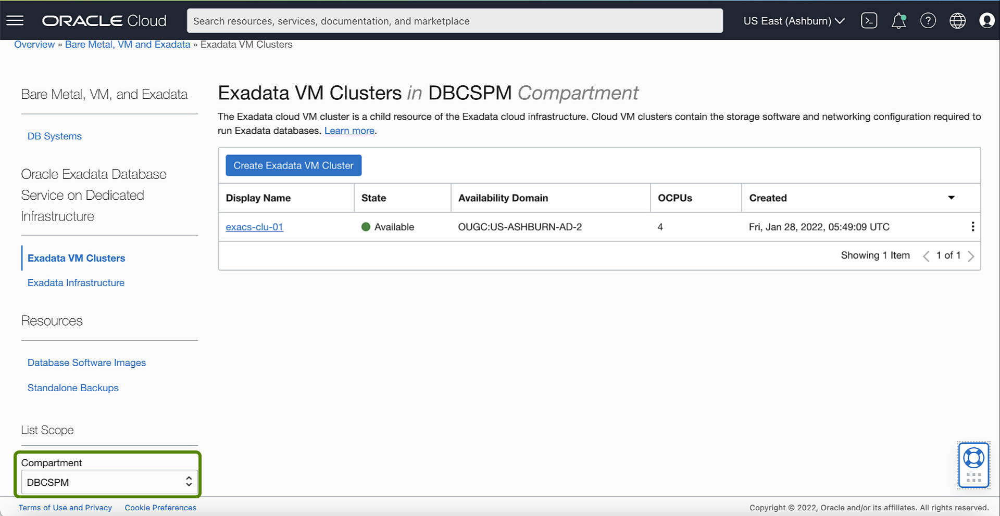
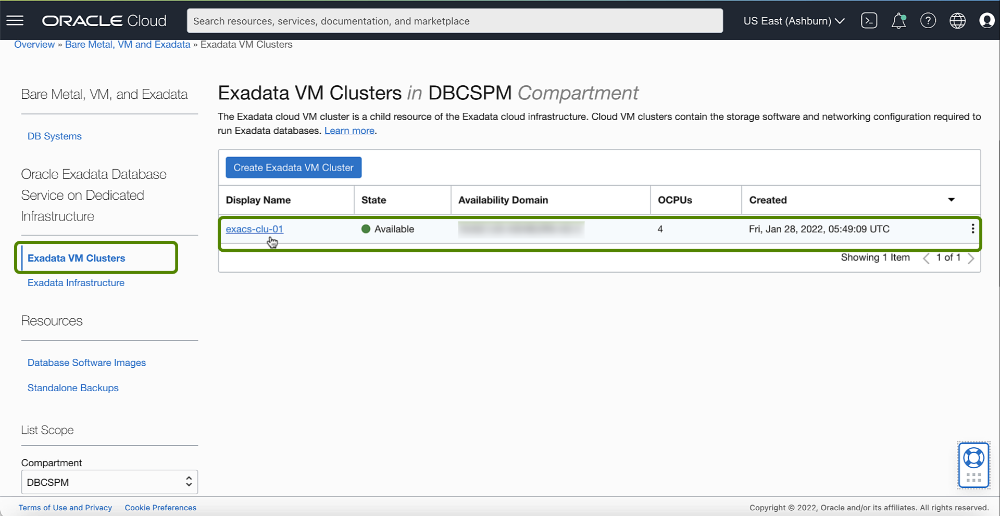

<!-- Updated April 5, 2022 -->

# Enable Data Guard on an Exadata Cloud Infrastructure

## Introduction

This lab walks you through the steps on how to Enable Data Guard. <!--You will use this database in subsequent labs of this workshop.-->

Estimated Lab Time: 10 minutes

### Objectives

-   Enable Data Guard on an Exadata Cloud Infrastructure

### Prerequisites

*Note: This lab requires completion of the following:*

* Completion of **Lab5** section.
* A correctly configured virtual cloud network (VCN) to launch the system in. Its related networking resources (gateways, route tables, security lists, DNS, and so on) must also be configured as necessary for the system
* The proper IAM policy is required to proceed See <a href="https://docs.oracle.com/en-us/iaas/exadatacloud/exacs/preparing-for-ecc-deployment.html#GUID-EA03F7BC-7D8E-4177-AFF4-615F71C390CD" target="\_blank">Required IAM Policy for Exadata Cloud Service</a>.

 <!-- add hyperlink for policies -->

 <!--
* The public key, in OpenSSH format, from the key pair that you plan to use for connecting to the system via SSH  -->

## Task 1: Using the Console to Enable Data Guard on an Exadata Cloud Infrastructure

1.  Click the navigation menu Click **Oracle Database**, then click **Exadata on Oracle Public Cloud**.

    

2.  Choose your **Compartment** that contains the Exadata Cloud Infrastructure instance with the database for which you want to enable Oracle Data Guard

    

3.  Navigate to the cloud VM cluster that contains a database you want to assume the primary role:

    Under **Oracle Exadata Database Service on Dedicated Infrastructure**, Click **Exadata VM Clusters**. In the list of VM clusters, find the VM cluster you want to access and click its highlighted name to view the details page for the cluster.

    

4. In the list of **Databases**, click the name of the database you want to make primary.

   

   

5. On the Database Details page, under **Resources**, click **Data Guard Associations**.

   

6. In the **Data Guard Associations** section, click **Enable Data Guard**.

   

7. On the Enable Data Guard page, configure your Data Guard association.

   

      * In the **Select peer DB system** section, provide the following information for the standby database to obtain a list of available Exadata systems in which to locate the standby database:

        * **Region**: Select a region where you want to locate the standby database. The region where the primary database is located is selected, by default. You can choose to locate the standby database in a different region. The hint text associated with this field tells you in which region the primary database is located.
        * **Availability domain**: Select an availability domain for the standby database. The hint text associated with this field tells you in which availability domain the primary database is located.
        * **Shape**: Select the shape of the standby Exadata system.
        * **Data Guard peer resource type**: Select DB System or **VM Cluster**.
        * Select a DB system or cloud VM cluster from the drop-down list.

      * **Data Guard association details**:

   

      * Data Guard Type: Select Active Data Guard or Data Guard. Active Data Guard provides additional features including: Real-Time Query and DML Offload, Automatic Block Repair, Standby Block Change Tracking, Far Sync, Global Data Services, and Application Continuity. Note that Active Data Guard requires an Oracle Active Data Guard license. For more information on Active Data Guard, see Active Data Guard. For a complete overview of both Data Guard types, see Introduction to Oracle Data Guard

          * Protection mode: The protection mode can be Maximum Performance or Maximum Availability. See Oracle Data Guard Protection Modes for information on these options.

          * Transport type: The redo transport type used for this Data Guard association.

      * In the **Choose Database Home** section, choose one of the following:

  

     * **Select an existing Database Home**: If you use this option, select a home from the Database Home display name drop-down list.

     * **Create a new Database Home**: If you choose this option, enter a name for the new Database Home in the **Database Home display name** field. Click **Change Database Image** to select a database software image for the new Database Home. In the **Select a Database Software Image** panel, do the following:

        * Select the compartment containing the database software image you want to use to create the new Database Home.

        * Select the Oracle Database software version that the new Database Home will use, then choose an image from the list
        of available images for your selected software version.

        * Click **Select**.

    * In the **Configure standby database**: section, provide standby database details.

     

     * **Database unique name**: Optionally, specify a value for the DB\_UNIQUE\_NAME database parameter. This value must be unique across the primary and standby cloud VM clusters. The unique name must meet the requirements:

       * Maximum of 30 characters
       * Contain only alphanumeric or underscore (_) characters
       * Begin with an alphabetic character
       * Unique across the VM cluster. Recommended to be unique across the tenancy.

     If not specified, the system automatically generates a unique name value, as follows:

                 <db_name>_<3_chars_unique_string>_<region-name>  

     * **Database password**: Enter the database administrator password of the primary database. Use this same database administrator password for the standby database.

8. Click **Show Advanced Options** to specify advanced options for the standby database:

      

      * **Management**:

        **Oracle SID prefix**: The Oracle Database instance number is automatically added to the SID prefix to create the **INSTANCE\_NAME** database parameter. The **INSTANCE\_NAME** parameter is also known as the SID. If not provided, then the SID prefix defaults to the first 12 characters of the **db\_unique\_name**.

        *Note*: Entering an SID prefix is only available for Oracle 12.1 databases and above.

        The SID prefix must meet the requirements:

           * Maximum of 12 characters
           * Contain only alphanumeric characters
           * Begin with an alphabetic character
           * Unique in the VM cluster and across primary and standby databases

9. Click **Enable Data Guard**.       

      

      When the association is created, the details for a database and its peer display their respective roles as **Primary** or **Standby**.

      

      

      

## Want to Learn More?

Click [here](https://docs.oracle.com/en-us/iaas/exadatacloud/exacs/using-data-guard-with-exacc.html) for documentation on how to use, configure and manage Oracle Data Guard with Exadata Cloud Infrastructure.

## Acknowledgements

* **Author** - Leo Alvarado, Product Management

* **Contributors** - Tammy Bednar, Eddie Ambler, Product Management

* **Last Update** - May 2022.
