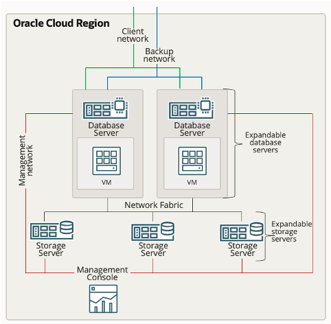

## Introduction

The labs in this workshop walk you through all the steps to get started using the Oracle Exadata Database Service to perform lifecycle tasks and procedures.

**What is an Oracle Exadata Database Service?**

Exadata Database Service allows you to leverage the power of Exadata in the cloud. Exadata Database Service’s scale-out architecture allows customers to provision more compute and storage independently easily, right-sizing their service to meet growing demands. Exadata Database Service offer RDMA over Converged Ethernet (RoCE) networking for high bandwidth and low latency, persistent memory (PMEM) modules, and intelligent Exadata software.

Built-in Oracle Maximum Availability Architecture (Oracle MAA) best practices increase database availability, Exadata Database Service reduces downtime and simplifies operational management with zero downtime maintenance, online scaling, and one-click provisioning of Oracle Real Application Clusters (Oracle RAC) and Oracle Active Data Guard using built-in cloud automation

**Network Overview: Exadata Database Service**

The Diagram outlines the high-level network architecture for Exadata Database Service.

**The Exadata Database Service** runs on the Exadata hosts which are virtualized with Dom0 for Oracle managed components and DomU for user managed components.
Your databases run on one or more virtual machines (VM) hosted on DomU.
Each Exadata Database Service instance provides two 25 Gbps networks for customer access: (Client and Backup)
Each Exadata Database Service instance provides a 1Gbps Cloud Operations network for use by the Oracle Cloud Operation team for Infrastructure maintenance.

**The Client Network** connects the Exadata database servers to your existing client network and is used for client access to the virtual machines.
Applications access databases on Exadata Database Service through this network using Single Client Access Name (SCAN) and Oracle Real Application Clusters (Oracle RAC) Virtual IP (VIP) interfaces.
The client access network uses a pair of network interfaces on each database server, which are connected to the customer network.

**The Backup Network** is similar to the client access network, as it connects the Exadata Database serversis provided to separates backup traffic and bulk transfers from application traffic.
Like the client network, the backup network uses a pair of network interfaces on each database server, which are connected to the customer network.

**The Oracle Cloud Operations Network** is a dedicated network connection used to perform infrastructure management tasks.
This network is solely for infrastructure management purposes conducted by the Oracle Operations team and cannot be accessed by customers.

**The RDMA Over Converged Ethernet (ROCE) Fabric Network** connects the Exadata database servers, and Exadata Storage Servers using the ROCE switches on the rack.
Each Database server and Storage server contains two ROCE interface (re0 and re1) that are connected to separate ROCE switches in the rack.
Oracle Database uses this network for Oracle RAC cluster interconnect traffic and for accessing data on Exadata Storage Servers.

**Service Architecture: Exadata Database Service**

Oracle Exadata Database Service on Dedicated Infrastructure provides Oracle's Exadata Database Machine as a service in an Oracle Cloud Infrastructure (OCI) data center. Alternatively, you can choose Oracle Exadata Database Service on Exadata Cloud@Customer, which provides Exadata Database Service that is hosted in your data center.

The Oracle Exadata Database Service is a virtual machine (VM) cluster that resides on Exadata infrastructure.
The Exadata Database Service System configuration starts with a fixed amount of OCPU, MEMORY, STORAGE, & NETWORK resources.

The Exadata Database Service architecture includes a minimum of 2 Exadata database servers and 3 Exadata storage servers connected by a high-speed, low-latency internal RoCE network fabric.
This minimum configuration provides HA protection from equipment failure and allows for the ASM in the storage layer to be provisioned in High Redundancy mode (Triple Mirroring of data across storage servers). The service in the Public cloud is scaled by simply adding additional Database or Storage servers required to your cloud Exadata Infrastructure resource to meet your needs.

When you subscribe to the Exadata Database Service, Oracle owns and manages the Exadata Infrastructure, and customers manage everything that runs in the database VM. The Customer VM known as DOMU includes the database software, grid infrastructure, data, schema, and encryption keys.

The Exadata Database Service supports Oracle database software releases Oracle Database 11g Release 2 (11.2) to Oracle Database 19c (19.0).
The Exadata Database Service simplifies lifecycle tasks, such as provisioning, scaling, patching, backup, and disaster recovery through Cloud Automation.

Application users and administrators can connect only to the database servers, using the CLIENT and BACKUP networks that you create while provisioning the Exadata Infrastructure & VM Cluster Resources. You access your database through standard Oracle database connection methods, such as Oracle Net. You access the VM cluster through standard Oracle Linux methods, such as token-based Secure Shell (SSH). Your administrator can use the web-based OCI Console, OCI command-line interface (CLI), and REST APIs to connect to your Exadata Database Service over an HTTPS connection.

The Physical database and storage servers are connected via the internal RoCE fabric network.
The VMs run on physical Exadata database servers and the VMs from each Exadata database server form a VM Cluster.
VMs can host one or more database homes and Database homes can host one or more RAC databases.
The Database Service can be Scaled Vertically and Horizontally online for performance and capacity by adding database servers and storage servers to the VM cluster.
The data is protected with ASM triple-mirroring which distributes copies of the data across the storage servers providing disk and storage server failure protection.

Oracle owns and manages the infrastructure. This include the database servers, storage servers, and the internal fabric network
Oracle Operations manages the infrastructure through the management network, which connects the database and storage server hardware.
You can schedule maintenance windows for Oracle to performance infrastructure maintenance during a window that best aligns with their business needs.

These hands-on lab guides provide step-by-step directions to setting up and using your Exadata Database Service on Dedicated Infrastructure

## Lab Breakdown
* Lab 1. Create your Virtual Cloud Network (VCN) and Required IAM Policy for Exadata Database Service on Dedicated Infrastructure
* Lab 2. Create an Exadata Cloud Infrastructure resource
* Lab 3. Create a Cloud VM Cluster resource
* Lab 4. Create Oracle Database Home on an Exadata Database Service on Dedicated Infrastructure       
* Lab 5. Create Oracle Database on an Exadata Database Service on Dedicated Infrastructure
* Lab 6. Connecting to an Exadata Cloud Service Instance
* Lab 7. Enable Automatic Backups for a Database
* Lab 8. Enable Data Guard on an Exadata Cloud Infrastructure System

# Introduction

## Acknowledgements

* **Author** - Leo Alvarado, Product Management

* **Contributors** - Tammy Bednar, Eddie Ambler, Product Management

* **Last Update** - May 2022.

**You are all set. Let us begin!**
